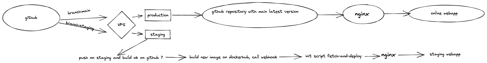

# My Custom Giphy Application

## 📺 Demo

You can test the application on [staging](https://staging.bordeaux3-0921.wns.wilders.dev/) or [prod](bordeaux3-0921.wns.wilders.dev/)

## 🚀 Purpose of the Project

This Project is an exercice for the Wild Code School

## ⚒ What the Application can do :

- It's a trello clone
- TODO....

## 🦾 Technical Stack

- [Create React App](https://github.com/facebook/create-react-app)
- [NodeJS](https://nodejs.org/en/)
- [GraphQL](https://graphql.org/)
- [Typescript](https://www.typescriptlang.org/)
- [TypeORM](https://typeorm.io/#/)
- [TailwindCSS](https://tailwindcss.com/)
- [Jest](https://jestjs.io/)

## ❓ How to start the Project in Local

### ⚙️ Install

1. First of all you need to clone the repostory into a local folder

2. Then you have to install the docker images by typing in your terminal :

```
docker-compose -f docker-compose.yml up --build
```

It will launch 4 containers :
mysql,
mysql_test,
api (back-end),
web (front-end)

### 🦸‍♂️ Run

Everything is good now you can yo to

Web
```sh
http://localhost:3000/
```
API
```sh
http://localhost:4000/graphql
```

### 🐻 How to run test from root

```
docker-compose exec api npm run test:watch
```

## 🤖 How's staging / prod works



The application has a continuous deployment on staging branch, when a PR is review and approved, the github CI do the checks update the new docker image. If any of the docker images changes, they call the webhook who init the script fetch and deploy on the VPS

Script fetch and deploy : 
```
#!/bin/sh
# fetch-and-deploy.sh
docker-compose -f docker-compose.dev.yml down && \
docker-compose -f docker-compose.dev.yml pull && \
GATEWAY_PORT=8001 docker-compose -f docker-compose.dev.yml up -d;
```
Webhook config :
```
[
  {
    "id": "update",
    "execute-command": "~relativepath/staging/fetch-and-deploy.sh",
    "command-working-directory": "~relativepath/staging"
  }
]
```
